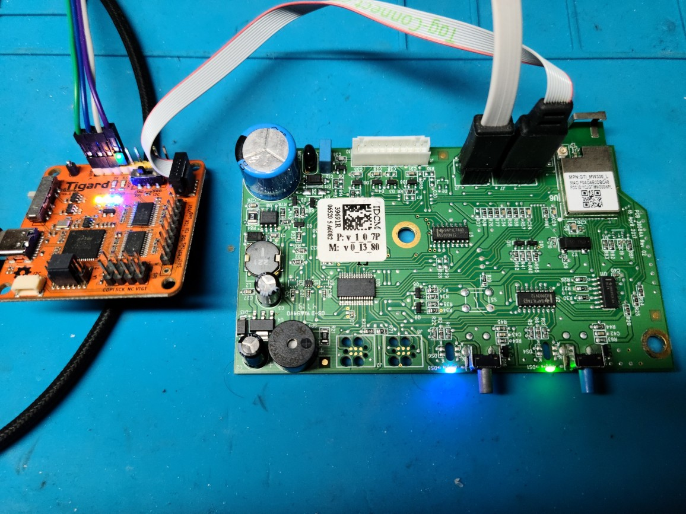

# Sesame

Sesame is an after-market firmware for the Genie 1155 garage door opener.
It also likely works with other models that utilize the same iDCM circuit
board.

This garage opener is supposed to be controllable over the network with the
Aladdin Connect app. However it appears to no longer work, probably because
of some breaking API change and the opener having reached end-of-life.
Hence the need for Sesame.

The Sesame firmware restores network control functionality, and can be
conveniently integrated into your home automation system via the MQTT
protocol. It does not communicate outside of your local network, just
like you like it for a security-sensitive application like a garage door.

## Features

* MQTT support
* HTTP server for configuration and control
* Over-the-air updates

## Installation



### Pre-requisites

Software:

* OpenOCD 0.12 or later
* protoc, the Protobuf compiler

Hardware:

* [TC2050-IDC-050] 10-pin cable to connect to the Cortex debug interface
* JTAG board with a 10-pin Cortex debug header, such as the [Tigard]

Optional but useful:

* [TC2030-PKT] 6-pin cable for serial console
* USB-to-TTL serial port adapter (you can also use the Tigard for this)

### First-time install

To install Sesame, you will use the Cortex debugger and OpenOCD
to write the firmware image to the flash memory of the MW300 module.

1. Clone this repository with the submodules (`git clone --recursive` or `git submodule update --init`)
1. Disconnect the header cable and remove the iDCM board from the unit.
1. Connect the push-pin connector of the 10-pin cable to header J7 on the iDCM board,
   and the other end to the Cortex debug interface on the Tigard.
1. (optional) Connect the 6-pin UART cable to header J3 on the iDCM board, and the other end
   to a USB-to-TTL serial converter (3.3V only). NOTE: The serial converter must supply 3.3V only.
1. Configure the Tigard for JTAG mode and 3.3V.
1. Connect Tigard to your computer.
1. (optional) If you connected the UART interface, you can now look at logs from the device
   in your terminal of choice, eg `minicom -D /dev/ttyUSB0 -b 115200`.
   At this point you should see the console output from the factory firmware.

Use this command to write all the components to flash: the partition table, boot loader, WiFi firmware,
and Sesame.
```sh
./tools/OpenOCD/flashprog.py -l mw320_sdk/tools/boot2/layout.txt \
  --boot2 mw320_sdk/mw320_matter_flash/Matter/boot2.bin \
  --wififw mw320_sdk/mw320_matter_flash/Matter/mw32x_uapsta_W14.88.36.p172.bin \
  --mcufw sesame.bin -r
```

After successful flash, the device should reboot and sound the buzzer. Logs from Sesame
should appear on the serial console.

Future firmware upgrades can be done over the air, so this procedure is only required the first time.

### Setup

Upon first-time install, the device will start a WiFi access point named `sesame`
and listen for HTTP connections at `192.168.4.1`. After connecting to the AP,
you can configure various settings as below. The REST API uses protobuf-encoded requests
(not JSON). Settings are stored in a flash partition in the same protobuf format, which
keeps things simple.

First, set up WiFi parameters:
```sh
echo 'hostname: "sesame", ssid: "MY_WIFI", security: 2, password: "seekrit"' \
  | protoc --encode=NetworkConfig proto/app_config.proto \
  | curl --data-binary @- -H content-type:application/protobuf -v \
  'http://192.168.4.1/cfg/network'
```
The device will reboot, connect to the configured network, and obtain an IP address via DHCP.
You will use its assigned IP address in the next steps (it is also logged on the serial console).

If using MQTT (replace `http://sesame` with your device's IP or hostname):
```sh
echo 'enabled: true, broker_host: "mqtt.example.org", broker_port: 1883, client_id: "sesame", username: "sesame", password: "seekrit", prefix: "sesame"' \
  | protoc --encode=MqttConfig proto/app_config.proto \
  | curl --data-binary @- -H content-type:application/protobuf -v \
  'http://sesame/cfg/mqtt'
```

Sesame can be configured to log to a syslog server.
```sh
echo 'syslog_config: { enabled: true, syslog_host: "log.example.org", syslog_port: 514 }' \
  | protoc --encode=LoggingConfig proto/app_config.proto \
  | curl --data-binary @- -H content-type:application/protobuf -v \
  'http://sesame/cfg/logging'
```

### Firmware update (OTA)

To update the firmware, the binary must be served via HTTP (not HTTPS). Sesame employs
an active-passive partition scheme, so that the upgrade image is written to a secondary
partition. The new image can then be safely tested before marking its partition as the
active one.

Having obtained the upgrade image, instruct Sesame to download and apply the update:
```sh
echo 'url: "http://example.org/sesame.bin"' \
  | protoc --encode=FirmwareUpgradeFetchRequest proto/api.proto \
  | curl --data-binary @- -H content-type:application/protobuf -v \
  'http://sesame/fwupgrade'
```

Following successful update, the device will reboot into the new
"testing" image, indicated by the OTA LED blinking blue. Unless it is
then promoted to primary, subsequent restarts will boot from the old
firmware.

Once satisfied that the new image is working, finalize the upgrade:
```sh
curl -v 'http://sesame/promote'
```

### LEDs and buttons

The opener has two physical buttons and corresponding LEDs:
* WiFi button (blue). Pressing this launches access point mode.
* OTA button (gray). Reboots the device.

Diagnostic LED patterns:

| Pattern    | WiFi LED     | OTA LED  |
| --------- | -----------  | -------- |
| Blinking green | Connecting | Main firmware image running |
| Solid green    | Connected  | - |
| Blinking blue  | AP enabled | Test firmware image running |

Pressing teh WiFi button starts the built-in access point (SSID `Sesame`, no password).
This is useful if you accidentally applied a bad network configuration.

## Development

The firmware can be built on Linux.

### Prerequisites

* CMake
* Ninja build system
* A cross-compiler for ARM.

On Debian:
```sh
apt install cmake ninja gcc-arm-none-eabi libnewlib-arm-none-eabi binutils-arm-none-eabi
```

The cross-compiler is specified in the `toolchain.cmake` file.

### Building

Two builds are required: A native build to compile the axf2firmware tool,
and a cross-compile of the firmware.

```sh
mkdir build-native
cd build-native
cmake -G Ninja ..
cd ..
mkdir build
cd build
cmake --no-warn-unused-cli -DCMAKE_BUILD_TYPE:STRING=Debug -DUSE_BACKTRACE=ON \
  -DCMAKE_EXPORT_COMPILE_COMMANDS:BOOL=TRUE -DCMAKE_TOOLCHAIN_FILE=../toolchain.cmake \
  -G Ninja -Daxf2firmware_DIR=~/src/sesame/build-native ..
```

For hardware details see [this doc](docs/teardown.md).

[TC2030-PKT]: https://www.tag-connect.com/product/tc2030-pkt-6-pin-cable-with-legs-for-use-with-microchip-pickit-3
[TC2050-IDC-050]: https://www.tag-connect.com/product/tc2050-idc-050
[Tigard]: https://github.com/tigard-tools/tigard
